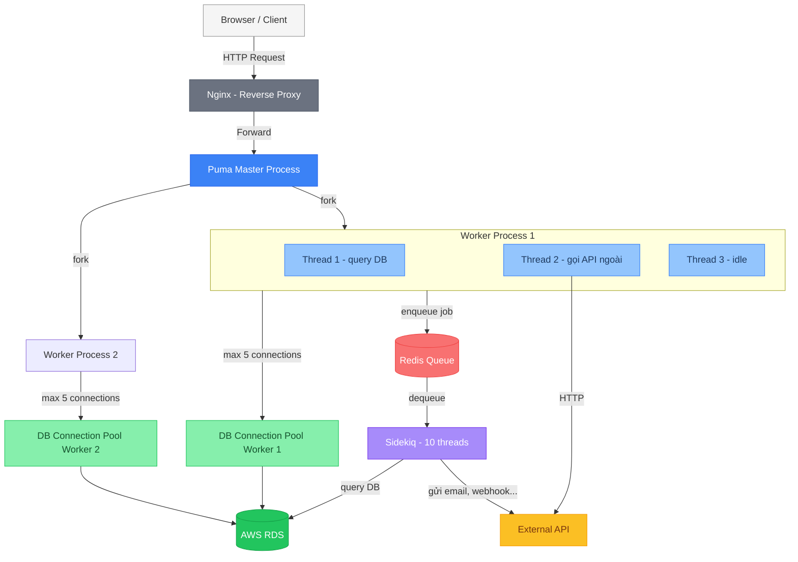
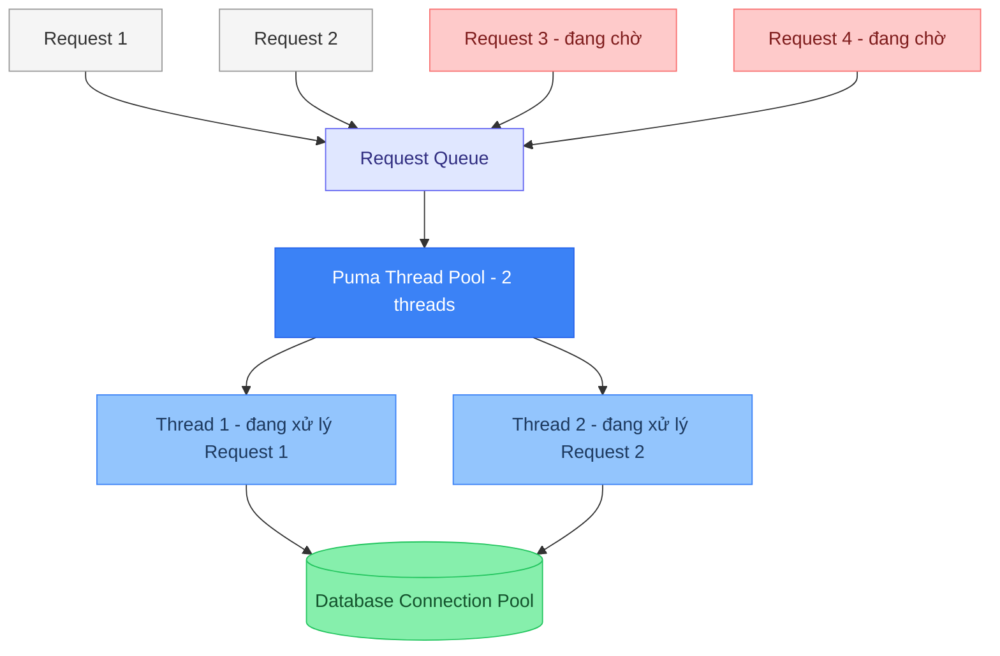
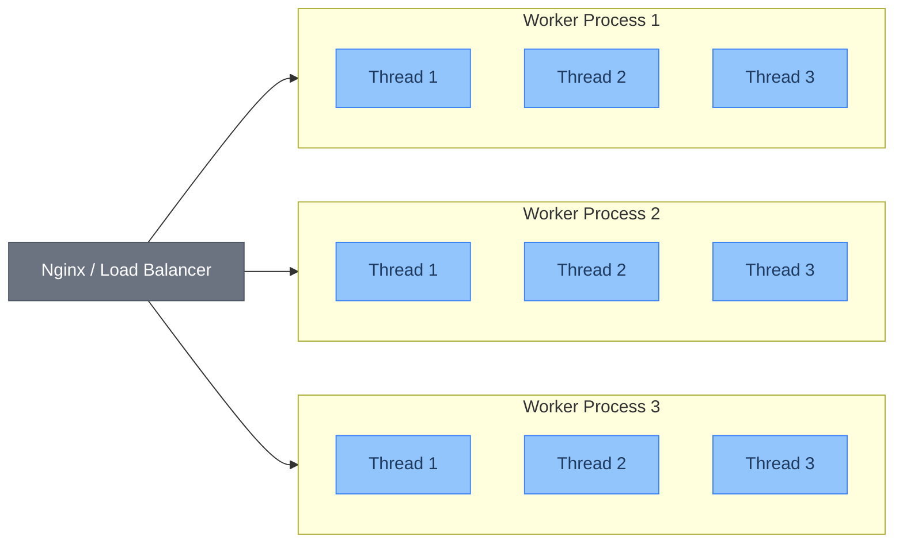
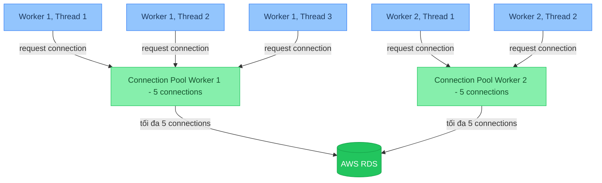
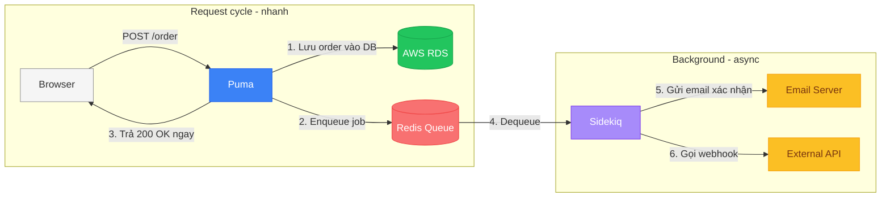

# Puma Hoạt Động Thế Nào, Và Bạn Đang Config Sai Chỗ Nào?

---

## TL;DR

- **Puma** dùng thread pool — mỗi request được xử lý bởi một thread, xong thì trả về pool.
- **Puma clustered mode** = nhiều worker process, mỗi process có thread pool riêng — dùng để tận dụng nhiều CPU core và bypass GVL.
- Mỗi thread cần một DB connection riêng — `pool size` trong `database.yml` phải bằng `RAILS_MAX_THREADS`. Đừng quên cộng thêm Sidekiq threads vào tổng connection budget khi tính giới hạn DB connection pool.
- **Workers = số CPU core** cho CPU-bound tasks; với web app I/O-bound thông thường, ưu tiên **tăng thread thay vì tăng worker** — ít tốn RAM hơn và hiệu quả hơn, miễn là DB connection pool đủ.
- **Sidekiq** là công cụ xử lý background job trong Rails — tách các tác vụ nặng (gửi email, xử lý ảnh...) ra khỏi request cycle, giúp Puma không bị block.
- 3 pitfall phổ biến nhất: shared state, thread > pool size, quá nhiều worker.

---

## "Tăng Thread Lên 32 Mà App Vẫn Chậm?"

Team quyết định tăng `RAILS_MAX_THREADS` lên 32 vì logic có vẻ đúng: nhiều thread hơn = xử lý được nhiều request hơn. Deploy xong, memory tăng vọt, response time không cải thiện, thỉnh thoảng xuất hiện `ActiveRecord::ConnectionTimeoutError`.

Vấn đề không phải ở số thread — mà ở chỗ tăng thread mà không hiểu thread pool, DB connection pool, và cách Puma thực sự hoạt động.

*-> Chúng ta hãy cùng tìm hiểu các thành phần trên và cách chúng tương tác với nhau qua bài viết này.*

> Nếu bạn chưa đọc [Bài 1](/blog/rails-concurrency-p1/) về Thread, Process và GVL — nên đọc trước để có nền tảng.

> Các ví dụ về DB connection limit trong bài dùng **AWS RDS** làm tham chiếu. Nếu bạn dùng database khác (self-hosted Postgres, PlanetScale, Supabase...), concept vẫn giống — chỉ khác con số giới hạn cụ thể.

---

## Bức Tranh Toàn Cảnh

Trước khi đi vào chi tiết, hãy nhìn tổng quan cách các thành phần phối hợp với nhau. Có 5 thành phần chính ảnh hưởng đến concurrency của một Rails app trên production:

- **Nginx** — reverse proxy, đứng trước Puma để phân phối request
- **Puma** — web server, nhận HTTP request từ Nginx và xử lý qua thread pool
- **DB Connection Pool** — mỗi thread cần một connection riêng khi query database
- **Sidekiq** — xử lý background job (gửi email, resize ảnh...) qua Redis queue
- **Database (AWS RDS)** — giới hạn số connection tối đa, là constraint chung cho cả Puma lẫn Sidekiq



*Puma xử lý HTTP request qua thread pool, Sidekiq xử lý background job qua Redis queue — cả hai đều cần DB connection. Tổng connection = (workers × threads) + sidekiq_threads phải nằm trong giới hạn của DB instance.*

---

## Phần 1: Puma Thread Pool

**Puma** là web server mặc định của Rails (từ Rails 5). Thay vì tạo một thread mới cho mỗi request (tốn kém), Puma duy trì sẵn một **thread pool** — tập hợp các thread chờ việc. Khi request đến, Puma lấy một thread **đang rảnh** từ pool ra xử lý, xong thì trả thread về pool.



*Chỉ có 2 thread trong pool — Request 3 và 4 phải chờ đến khi Thread 1 hoặc 2 xử lý xong và trả về pool. Đây là lý do config số thread quá ít tạo bottleneck ngay cả khi DB còn dư capacity.*

### Clustered Mode: Kết Hợp Process + Thread

Một process Rails chỉ có một GVL — nghĩa là dù có bao nhiêu thread, vẫn chỉ một thread chạy Ruby code tại một thời điểm. Để tận dụng nhiều CPU core, Puma có **clustered mode**: chạy nhiều **worker process**, mỗi process có thread pool và GVL riêng.



*Mỗi worker process là bản copy độc lập của app, fork từ master. Memory tăng tuyến tính theo số worker — không phải bug, mà là trade-off để bypass GVL và chạy song song thực sự trên nhiều CPU core.*

### Workers vs Threads: Nên Tăng Cái Nào?

Đây là câu hỏi hay gặp nhất khi tune Puma, và câu trả lời phụ thuộc vào **loại workload**:

| | CPU-bound | I/O-bound (web thông thường) |
|---|---|---|
| **Ví dụ** | Xử lý ảnh, mã hóa, tính toán nặng | Query DB, gọi API ngoài, đọc file |
| **Bottleneck** | CPU core | Thời gian chờ I/O |
| **Nên tăng** | Workers (thêm process = thêm GVL riêng) | Threads (dùng chung RAM, tận dụng I/O wait) |
| **RAM cost** | Cao — mỗi worker ~300MB | Thấp — thread dùng chung vùng nhớ |

Với **web app Rails thông thường** — CRUD, query DB, gọi external API — workload gần như luôn là I/O-bound. Trong trường hợp này, **tăng thread hiệu quả hơn tăng worker**: ít tốn RAM hơn, và thread tận dụng được thời gian I/O wait để xử lý request khác.

Giới hạn thực tế khi tăng thread không phải là GVL, mà là **DB connection pool** — mỗi thread cần một connection riêng. Nếu dùng managed database như **AWS RDS**, số connection tối đa phụ thuộc vào instance size (ví dụ `db.t3.medium` chỉ cho phép ~60–80 connections). Tăng thread vượt quá giới hạn đó sẽ gây `ConnectionTimeoutError`.

### Công thức tính Workers và Threads

Trước khi config, hãy tính ngược từ DB connection limit để không bị `ConnectionTimeoutError`:

```
# Bước 1: Xác định workers
workers = số CPU core

# Bước 2: Tính max threads có thể dùng
max_threads = (DB connection limit - sidekiq_threads) / workers

# Kiểm tra tổng:
tổng DB connection = (workers × threads) + sidekiq_threads ≤ DB connection limit
```

**Ví dụ thực tế** — server 2 CPU core, AWS RDS `db.t3.medium` (~80 connections), Sidekiq 10 threads:

```
workers  = 2
available_for_puma = 80 - 10 = 70
max_threads        = 70 / 2  = 35  ← ceiling lý thuyết

# Thực tế: >10 threads/worker với I/O-bound thường không tăng throughput
# mà còn tăng latency vì GVL contention. Nên chọn:
threads = 5  # an toàn, hoặc 10 nếu app rất I/O-heavy

# Kiểm tra: (2 × 5) + 10 = 20 connections ← còn nhiều headroom ✓
```

**Config thực tế:**

```ruby
# config/puma.rb

# I/O-bound web app: giữ workers = số CPU core, tăng threads nếu cần
# CPU-bound: tăng workers, giữ threads thấp (2-3)
workers ENV.fetch("WEB_CONCURRENCY") { 2 }  # = số CPU core

# Điểm xuất phát: 5. Có thể tăng lên 10-16 nếu app I/O-heavy
# và AWS RDS instance còn dư connection headroom
threads_count = ENV.fetch("RAILS_MAX_THREADS") { 5 }
threads threads_count, threads_count

preload_app!

on_worker_boot do
  ActiveRecord::Base.establish_connection if defined?(ActiveRecord)
end
```

---

## Phần 2: DB Connection Pool — Mắt Xích Hay Bị Quên

Mỗi thread cần một DB connection riêng khi đang query. Nếu bạn có 3 workers × 5 threads = 15 threads đồng thời, app cần tối đa 15 DB connection.

Rails quản lý điều này qua **connection pool** trong `database.yml` — mỗi worker process có một pool riêng:

```yaml
# config/database.yml
production:
  adapter: postgresql
  pool: <%= ENV.fetch("RAILS_MAX_THREADS") { 5 } %>
  # pool size = số thread mỗi worker — KHÔNG phải tổng toàn app
```



*Tổng DB connection = workers × pool_size. Với 2 workers × 5 threads = 10 connections. AWS RDS giới hạn connection theo instance size — `db.t3.micro` chỉ cho ~25 connections, `db.t3.medium` khoảng 60–80. Nếu horizontal scaling với nhiều app instance, con số này cộng dồn rất nhanh và là lý do thường gặp của `ConnectionTimeoutError` trên production.*

> **Why this matters:** Tăng thread mà không tăng pool size → thread ngồi chờ connection → response time tăng mà CPU vẫn thấp. Bạn lại nghĩ "hết thread rồi", tiếp tục tăng thread → tệ hơn.

---

## Phần 3: Sidekiq — Xử Lý Async Đúng Cách

Puma xử lý HTTP request — nhưng không phải tác vụ nào cũng nên nằm trong request cycle. Gửi email, resize ảnh, gọi webhook, generate báo cáo... những việc này có thể mất vài giây hoặc vài phút. Nếu để Puma thread ngồi chờ, request đó bị block trong suốt thời gian đó, thread không thể nhận việc khác.

**Sidekiq** giải quyết bằng cách tách các tác vụ nặng ra khỏi request cycle: thay vì xử lý ngay, Rails đẩy job vào **Redis queue**, Sidekiq chạy riêng và xử lý bất đồng bộ.



*Puma trả response ngay sau khi enqueue job — user không phải chờ email được gửi. Sidekiq xử lý phần còn lại ở background hoàn toàn độc lập.*

Sidekiq cũng dùng **thread pool** giống Puma — mặc định 10 threads, mỗi thread xử lý một job. Và cũng có cùng ràng buộc: mỗi Sidekiq thread cần một DB connection riêng nếu job có query DB.

```ruby
# config/initializers/sidekiq.rb
Sidekiq.configure_server do |config|
  config.redis = { url: ENV['REDIS_URL'] }

  # Sidekiq mặc định 10 threads — đảm bảo DB pool đủ cho cả Puma lẫn Sidekiq
  # Tổng connection cần = (puma_workers × puma_threads) + sidekiq_threads
  Rails.application.config.after_initialize do
    ActiveRecord::Base.connection_pool.disconnect!
    ActiveRecord::Base.establish_connection(
      ActiveRecord::Base.configurations.find_db_config(Rails.env).configuration_hash
        .merge(pool: ENV.fetch("RAILS_MAX_THREADS") { 5 })
    )
  end
end
```

> **Why this matters:** Một lỗi hay gặp là chỉ tính DB connection cho Puma mà quên Sidekiq. Nếu Sidekiq chạy cùng server với 10 threads, bạn cần cộng thêm 10 vào tổng connection budget khi tính giới hạn AWS RDS.

---

## Common Pitfalls Và Cách Tránh

### ❌ Pitfall 1: Shared Mutable State

```ruby
# NGUY HIỂM — class variable được chia sẻ giữa tất cả thread
class OrderProcessor
  @@current_user = nil  # shared across ALL threads!

  def process(user, order)
    @@current_user = user              # Thread A ghi user A
    # ... context switch xảy ra ở đây ...
    send_confirmation(@@current_user)  # Thread B đã ghi đè = user B!
  end
end
```

```ruby
# AN TOÀN — dùng local variable
class OrderProcessor
  def process(user, order)
    current_user = user  # chỉ thuộc về stack của thread hiện tại
    send_confirmation(current_user)  # luôn đúng
  end
end
```

Rails đã thiết kế thread-safe: mỗi request tạo một controller instance mới, không share state. Nhưng nếu bạn tự tạo `@@class_variable` hay `$global`, bạn đang tự bắn vào chân mình.

### ❌ Pitfall 2: Thread Nhiều Hơn DB Connection Pool

```
# SAI
RAILS_MAX_THREADS=10
# database.yml pool: 5  ← chỉ 5 connections

# Kết quả: 5 thread cuối phải chờ connection
# → ActiveRecord::ConnectionTimeoutError
```

**Rule of thumb:** `pool size = RAILS_MAX_THREADS`. Luôn luôn.

### ❌ Pitfall 3: Tăng Worker Không Giới Hạn

```
WEB_CONCURRENCY=16  # 16 workers × ~300MB RAM = ~4.8GB chỉ cho Rails

# Mỗi worker là một full copy của app trong memory
# Nhiều hơn số CPU core = không thêm throughput, chỉ thêm RAM
```

**Rule of thumb:** `workers = số CPU core`.

---

Concurrency không phải chủ đề chỉ dành cho senior. Càng hiểu sớm, bạn càng tránh được những đêm thức debug mà nguyên nhân chỉ là... một dòng config thiếu trong `puma.rb`.

Nhưng tối ưu Puma, DB pool và Sidekiq chỉ giúp bạn **scale trên một server**. Khi traffic vượt quá khả năng của một máy, bạn cần nghĩ xa hơn — horizontal scaling với nhiều instance, container orchestration với Kubernetes, caching layer, CDN, và cách deploy Rails app để phục vụ user ở nhiều region trên toàn cầu. Đó là chủ đề của **Bài 3**.